

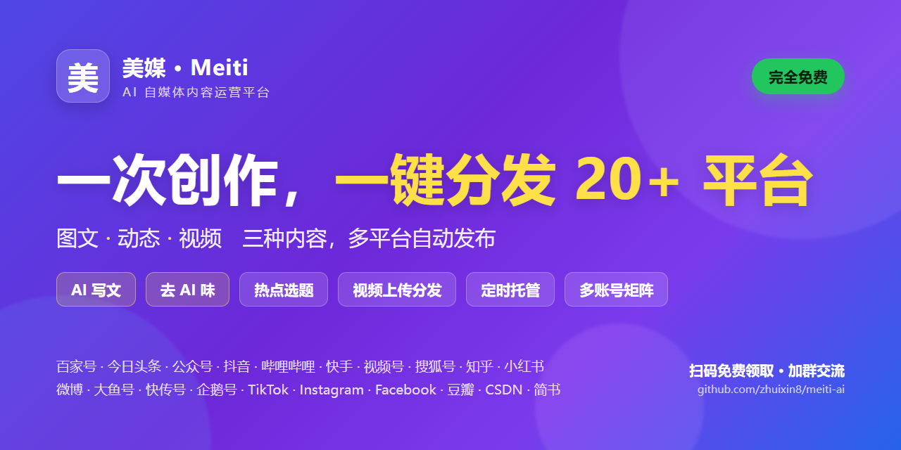

# 美媒 · AI 自媒体内容运营平台

### 一次创作，一键分发到 20+ 主流平台 —— **完全免费**

**图文 · 动态 · 视频** 三种内容，一处创作多平台分发 · AI 写文 · 去 AI 味 · 定时托管 · 多账号矩阵

### 📥 [点此下载 Windows 桌面端（最新版）](https://github.com/zhuixin8/meiti-ai/releases/latest)

**👉 [扫码加微信，免费领取使用](#-免费领取--加入交流群) · 进群一起玩转自媒体自动化运营**

---

## 💡 这是什么

**美媒** 是一款面向自媒体创作者、工作室、矩阵号运营者的 **AI 内容生产 + 多平台自动分发** 平台。

**图文文章、动态/微头条、视频** 三种内容形态全都能发 —— 你只需要在一个后台里完成创作或上传，剩下的繁琐工作（改写、配图、登录各平台、逐个上传/复制粘贴、排版、设封面、加话题、定时发布）**全部交给它自动完成**。

> 💬 一条内容、一个视频，原本要手动发 20 次。现在，**点一次**。

支持 **网页端**（打开即用）和 **桌面端**（本地浏览器发布、全程可见、更稳），用自己的 AI 密钥成本可控，也能用平台免费额度 0 成本上手。

---

## 🖼️ 界面预览

<table>
<tr>
<td width="50%">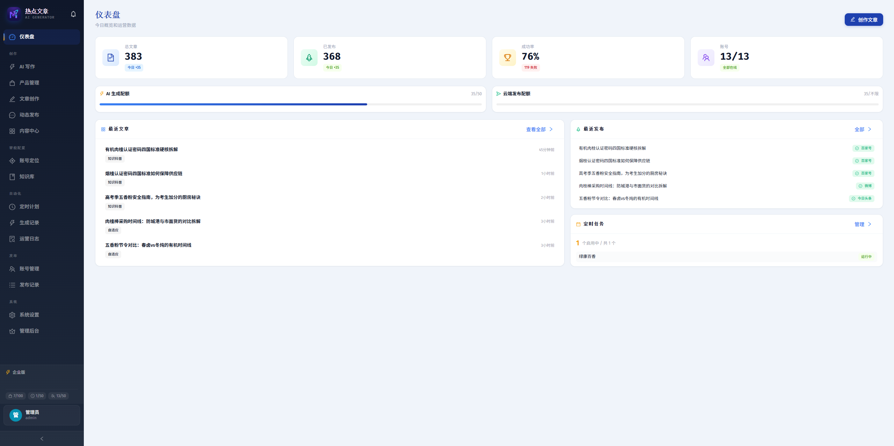 <b>📊 运营仪表盘</b> —— 总文章 / 已发布 / 成功率 / 账号状态 / 今日配额 / 定时任务，一屏掌握</td>
<td width="50%">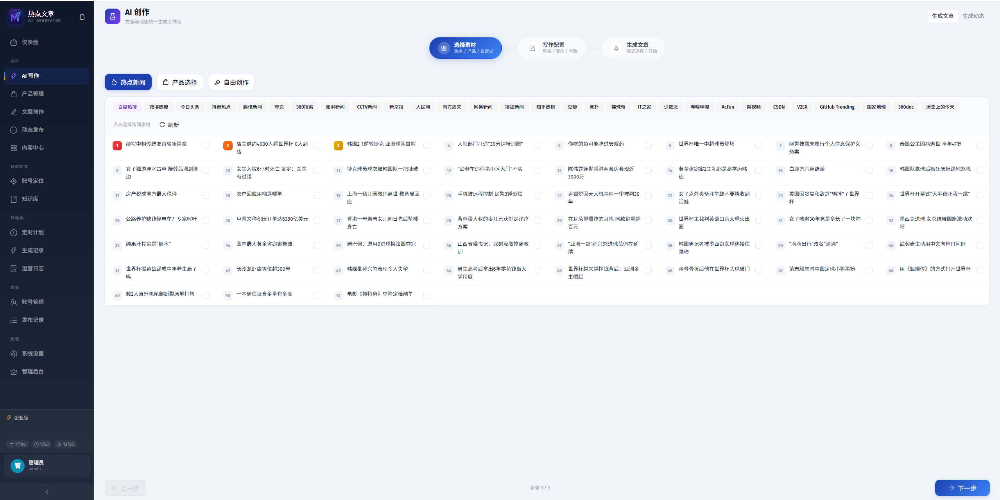 <b>🔥 AI 写作 · 热点选题</b> —— 实时聚合全网热点，点一下就基于热点成文</td>
</tr>
<tr>
<td width="50%">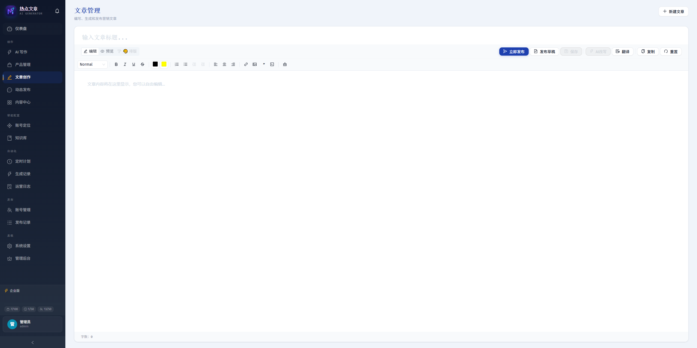 <b>✍️ 文章创作</b> —— 所见即所得编辑器，AI 改写 / 翻译 / 一键发布</td>
<td width="50%">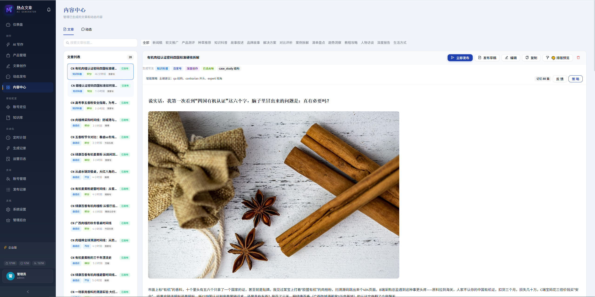 <b>🗂️ 内容中心</b> —— 文章集中管理与预览，一键多平台分发</td>
</tr>
<tr>
<td width="50%">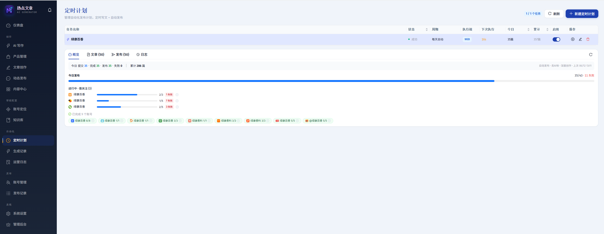 <b>⏰ 定时计划</b> —— 无人值守自动「抓热点 → 成文 → 多账号发布」</td>
<td width="50%">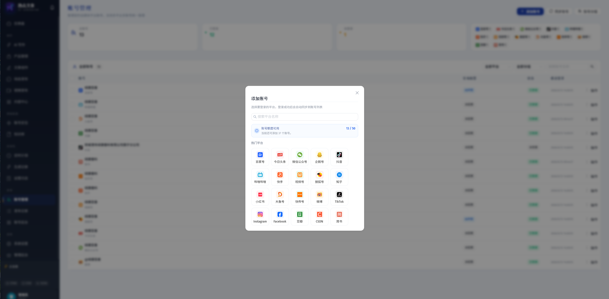 <b>🌐 多平台账号</b> —— 一处管理 20+ 平台账号，扫码登录即用</td>
</tr>
<tr>
<td width="50%">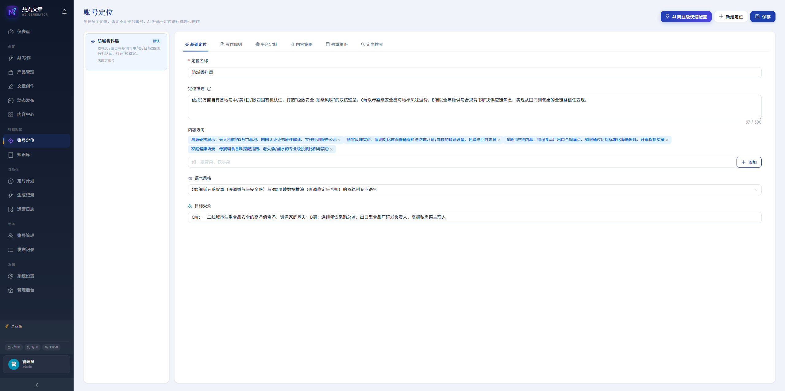 <b>🎯 账号定位</b> —— 为每个号设定人设 / 风格 / 平台适配，内容更"像人"</td>
<td width="50%">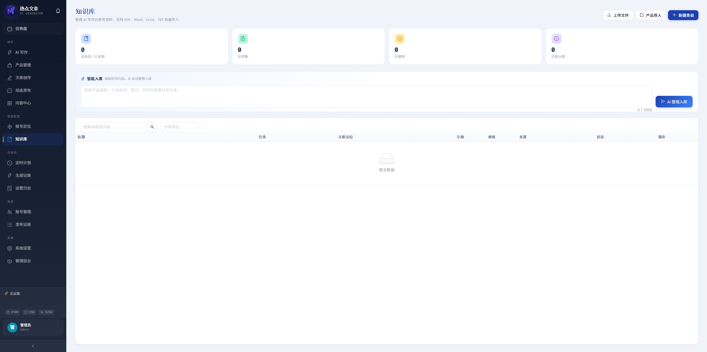 <b>📚 知识库</b> —— 上传 PDF / Word / Excel / TXT，AI 自动整理为写作素材</td>
</tr>
<tr>
<td width="50%">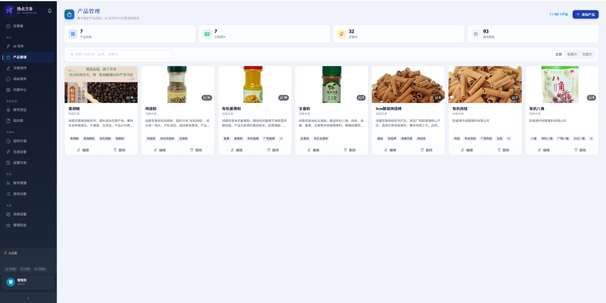 <b>🛍️ 产品管理</b> —— 带货 / 品牌内容，统一管理产品素材</td>
<td width="50%">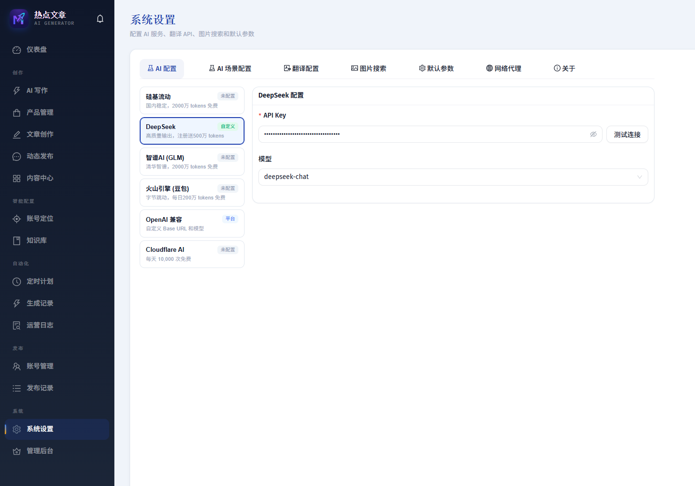 <b>⚙️ AI 配置</b> —— 接入多家 AI（含免费额度），可填自己的密钥</td>
</tr>
</table>

---

## 🆓 为什么完全免费

我们把这套平台 **完全免费** 开放给所有创作者：

- ✅ **免费注册、免费使用** 全部核心功能
- ✅ **免费发布到 20+ 个平台**，不限平台数量
- ✅ 支持 **填写你自己的 AI 密钥**，用自己的额度，成本完全可控
- ✅ 也可使用平台提供的 **免费额度**，0 成本上手
- ✅ 桌面端 **免费下载**，持续更新

> 我们相信好工具应该让更多人用得起。**[加微信 / 进群](#-免费领取--加入交流群)，第一时间领取使用资格、获取更新与答疑支持。**

---

## 🚀 支持的 20 个平台

一份内容，自动分发到全网主流图文 / 视频 / 社区 / 出海平台：

| 资讯图文 | 短视频 | 社区 / 问答 | 出海 |
|---|---|---|---|
| 百家号 | 抖音 | 知乎 | TikTok |
| 今日头条 | 哔哩哔哩 | 小红书 | Instagram |
| 微信公众号 | 快手 | 豆瓣 | Facebook |
| 企鹅号 | 视频号 | 简书 | |
| 搜狐号 | | CSDN | |
| 大鱼号 | | | |
| 快传号 | | | |
| 微博 | | | |

> 🔌 持续接入更多平台中，欢迎在群里提需求。
>
> 🎬 其中 **17 个平台支持视频上传分发**（抖音 / B站 / 快手 / 视频号 / 小红书 / 西瓜 / 头条 / 百家号 / 微博 / TikTok / Instagram / Facebook 等）。

---

## ✨ 核心功能详解

### 📝 AI 内容创作
- **AI 一键成文**：给个标题 / 选题，自动生成结构完整、可直接用的文章
- **热点选题**：实时抓取全网热点榜单，一键基于热点创作，蹭得上流量
- **去 AI 味**：内置「人味化」改写引擎，让文章读起来像真人写的，降低同质化与判重风险
- **账号定位 / 人设**：为每个账号设定人设、写作风格、平台调性，输出内容更贴合账号
- **知识库**：上传 PDF / Word / Excel / TXT 或粘贴文本，AI 自动整理为可引用的写作素材
- **产品库**：带货 / 品牌运营，统一管理产品资料，写作时自动调用
- **智能配图**：自动检索高清配图，图文并茂

### 🎬 视频上传分发
- **一个视频，多平台同步**：上传一次，自动分发到抖音、B站、快手、视频号、小红书、西瓜、今日头条、百家号、微博、TikTok、Instagram、Facebook 等 **17 个平台**
- **自动填资料**：标题、简介、封面、话题/标签、合集、可见性等逐平台自动适配
- **进度可视**：上传 / 转码 / 发布全程进度可见，失败可重试

### 📣 动态 / 微头条
- 支持 **动态、微头条、瞬间** 类短内容群发（头条、百家号、B站、抖音、搜狐、公众号等）
- 适合日常种草、短资讯、互动话题，养号涨粉两不误

### 📤 多平台自动发布（图文 / 动态 / 视频通用）
- **一键分发**：一条内容勾选多个平台 / 多个账号，自动并行发布
- **平台适配**：自动处理各平台的标题、正文、封面、话题、可见性、排版差异
- **真实浏览器自动化**：模拟真人操作发布，稳定可靠
- **发布日志 & 智能重试**：每次发布全程留痕，失败可一键智能重试

### ⏰ 定时托管 & 矩阵运营
- **定时计划**：设好时间，自动「抓热点 → AI 成文 → 多账号发布」全流程无人值守
- **多账号矩阵**：集中管理多平台、多账号，批量调度
- **数据看板**：发布量、成功率、配额用量一目了然

### 🤖 接入的 AI 模型
DeepSeek · 硅基流动 · 智谱 AI（GLM）· 火山引擎（豆包）· Cloudflare AI · **OpenAI 兼容接口**（任意自建 / 第三方模型）

> 多家均提供免费额度；也可填入你自己的密钥，用哪家、用什么模型，自己说了算。

---

## 🖥️ 两种使用方式

| | 网页端 | 桌面端（推荐） |
|---|---|---|
| **安装** | 打开网址即用 | 下载安装包，一键安装 |
| **发布方式** | 云端自动发布 | 本地浏览器发布，**全程可见、更稳** |
| **适合** | 随时随地轻量使用 | 矩阵号 / 重度运营 |

> 桌面端登录账号时会打开真实浏览器窗口扫码 / 手动登录，Cookie 安全保存在本地，发布过程肉眼可见、更安心。

---

## 👥 适用人群 & 常见用途

- **自媒体创作者 / 工作室**：一篇文章同步分发全平台，告别手动复制粘贴
- **矩阵号运营 / MCN**：多平台、多账号集中管理，定时自动发布，效率翻倍
- **品牌 / 电商带货**：产品库 + AI 文案 + 多平台铺量，统一种草
- **个人副业 / 流量主**：蹭热点选题、AI 成文、自动发布，低成本起号
- **想替代付费工具的人**：完全免费，自带 AI 免费额度，也可用自己的密钥

**常被用来解决这些需求**：
自媒体一键发布工具 · 多平台同步发布 · 今日头条自动发布 · 百家号批量发布 · 公众号自动发布 · 抖音图文自动发布 · 小红书批量发布工具 · 知乎 / 微博 / B站自动发布 · AI 写文章工具 · AI 去味 / 降 AIGC 率 · 自媒体矩阵管理 · 热点选题工具 · 免费自媒体运营软件

---

## 📲 免费领取 / 加入交流群

遇到问题、想要新功能、领取使用资格、获取最新版本，欢迎加我们：

<table>
<tr>
<td align="center" width="33%">

### 👤 加我微信

**业精于勤**

加好友备注「**自媒体**」 领使用资格 · 拉你进群 · 领最新版

</td>
<td align="center" width="33%">

### 👥 微信群

**自媒体自动化运营**

扫码进群（二维码定期更新） **过期请加左侧微信拉你进群**

</td>
<td align="center" width="33%">

### 🐧 QQ 群

**新媒体自动化运营 · 733861251**

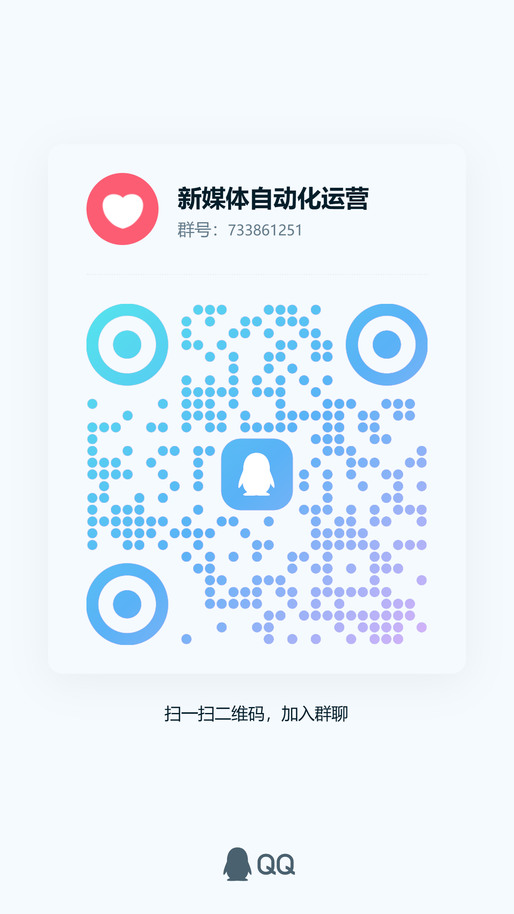

扫码 或 [点击加群](https://qm.qq.com/q/2jRwOrOOYg) 搜群号 **733861251** 也可加入

</td>
</tr>
</table>

---

## 📄 授权说明

「美媒」是**免费但专有**的软件:个人可免费使用,但**软件本身不开源**。

本仓库仅包含项目介绍、界面截图、二维码与安装包,**不含源代码**。未经书面授权,禁止反编译、二次分发、转售或克隆为同类产品。详见 [LICENSE](LICENSE)。如需商业授权或合作,请通过上方联系方式联系我们。

---

## English

**Meiti** — a **free** AI-powered content operation platform for social-media creators.

**Create once, publish everywhere.** Generate articles with AI, remove the "AI flavor", and automatically distribute **articles, moments and videos** to **20+ major platforms** (Baijiahao, Toutiao, WeChat, Douyin, Bilibili, Kuaishou, Zhihu, Xiaohongshu, Weibo, TikTok, Instagram, Facebook, and more). **Video upload & distribution is supported on 17 platforms.**

**Key features:** AI writing from trending topics · **one-click video upload to multiple platforms** · knowledge base (PDF/Word/Excel/TXT) · per-account persona & style · one-click multi-platform publishing with real-browser automation · scheduled unattended pipelines · multi-account matrix management.

**Use your own AI keys** (DeepSeek, SiliconFlow, Zhipu, Volcengine, Cloudflare, any OpenAI-compatible endpoint) or the free quota. Available as a **web app** and a **desktop app**.

> 💬 **Scan the WeChat QR codes above to get free access and join the community.**

 

**美媒 · 让自媒体运营更轻松** — 一次创作 · 一键分发 · 永久免费

⭐ 觉得好用，欢迎 **Star** 支持！

